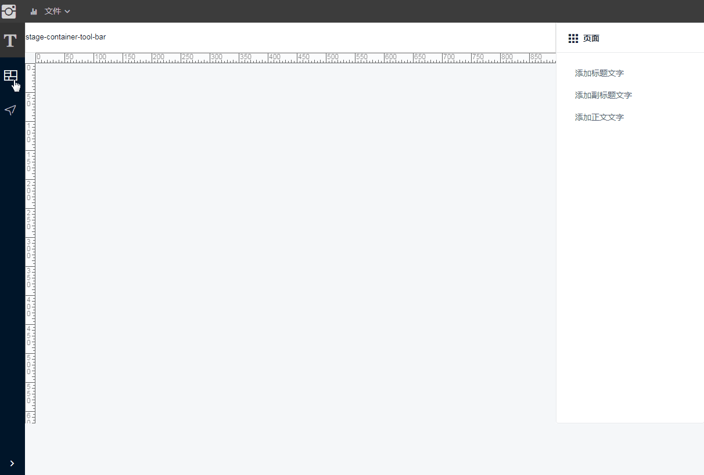

# 第三部分 推拽画布
有了前两部分的基础，我们做画面其实可以顺很多了。    
这里在containter区域做了一个画布，要实现功能为从侧边栏推拽一个组件进来，并正常显示。   

## 推拽功能与组件
draggable功能本身是由HTML5 自身提供的功能，任何元素都能够拖放。    
而世面上有形形色色的draggable组件，取决你的需求以及认识程度。   
组件的功能是帮你完成一些动态效果，或者拖拽组合等等不同功能。   
我们选用vue-draggable，原因：：vue整合，组内拖拽，实体数据列表，拖拽对象变换等等功能。    

选用vue-draggable的原因也是我们的需求了，当然其他的组件可能也可以实现这些功能。不过我就不去想了。   
side-menu中通过路由载入了cLayout.vue, cLayout使用:list="wrapItemList" 生成一个可拖拽的list   
通过指定`:group="{ name: 'stage'}` 来限定可拖拽的对象组，那么组外就不会响应推拽动作了。这可比自己写filter强多了。   
要拖拽到的目标区域设置同样的group，则两组对象可以相互拖拽。   
`pull: 'clone'` 的设定是该对象不能被拉走，而是另复制一份，以及`put: 'false'`该区域不能增加推拽对象   

```html
  <draggable class="list-wrap" :list="wrapItemList" :sort="false" :group="{ name: 'stage', pull: 'clone', put: 'false' }">
    <div class="list-item ng-star-inserted" v-for="wrapItem of wrapItemList" :key="wrapItem.index">
      
      <span class="img-info-btn"><i class="wrapItem.icon"></i></span>
    </div>
  </draggable>
```

说一下`:list="wrapItemList"`， 这个是为了让拖拽对象变成数据对象，而不是实际的表示对象而使用的。   
数据对象有什么好处呢？ 因为它可以从数据变成任何符合数据的表现形式，就是说，拖拽的对象表现形式和拖拽的目标区域后的表现形式是可以不一样的。   
我用这个功能来实现拖拽图标对象形成一个layout的表现。   

继续：
拖拽对象有了，那目标区域呢？ 见 `stage-container.vue`   
和上边说的一样，我们在这个区域设定一个`group="stage"`,这样两个区域就绑定上了。   
`:list="stageComponents"` 是这个区域的实际数据，当然就是为了接收拖拽过来的数据用的。是不是传值问题也解决了。真聪明   
```html
  <draggable class="stage-panel" group="stage" :list="stageComponents">
    <StageComponentBridge v-for="(element,index) in stageComponents" :key="index" :idx="element.idx" />
  </draggable>
```

`<StageComponentBridge/>` 组件干啥的？ 这不是就是拖拽来的数据的新表现形式么。   
我用它来装在IViewUI组件模板    

到这里拖拽其实就完成了。

## 动态加载vue模板
参考和验证了好几个方法，最终走了一条自己的路。我觉得这个路子很简单很简单。它不需要动态编译，不需要配置，甚至可以利用所有已知的组件，而不需要重新设定。    
支持主体框架搭载的所有功能，意思就是你的`main.js`里搭载的功能它都是能用的，因为它本身就是它的一部分。

```javascript
<template>
  <div class="stage-component-bridge" :id="getId">
    <component :is="currentTabComponent"/>
  </div>
</template>
import Vue from 'vue';
export default {
  name: 'StageComponentBridge',
  computed: {
    getId () {
      return getUuid()
    },
    currentTabComponent () {
      let idx = this.idx
      if (!this.hasComponent(idx)) {
        Vue.component(idx, function (resolve) {
          require(['_c/template/iView-UI/' + idx + '.vue'], resolve)
        })
      }
      return this.idx
    }
  },
```

这里使用的最重要的功能就是VUE提供的异步加载功能。这段代码只有运行的时候才会从项目目录中找到对应的组件加载进来。   
加载后组件的名字为idx所指定的值， 假设idx的值为 `'lay-abc'` 那么这个组件的名字就叫 `'lay-abc'`    
当使用动态组件标签`<component :is="currentTabComponent"/>` 时，只要让`currentTabComponent='lay-abc'`就可以了。  
Very Easy    
```java
Vue.component(idx, function (resolve) {
  require(['_c/template/iView-UI/' + idx + '.vue'], resolve)
})
```

`<component>`标签几乎可以加载所有能被识别的组件了。   

***
#效果展示


***
跳转到： [第二阶段](./README%20section2.md "阶段二") … [第四阶段](./README%20section4.md "阶段四"). 